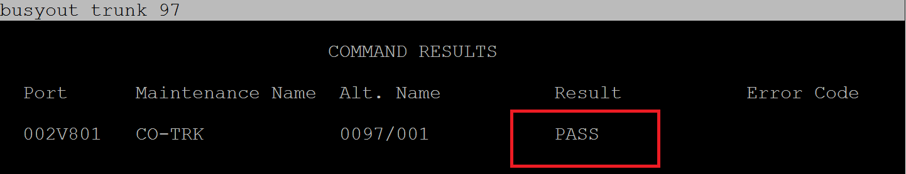
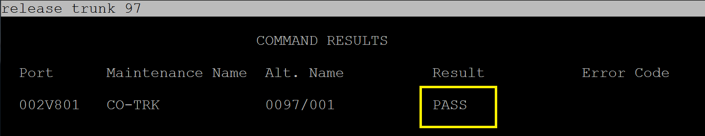

This is the reset procedure by computer when the overhead paging system rings busy when called.  The same thing would apply to a complaint of the Voice Mail system is busy, only difference would be Trunk Number

** IT RINGS BUSY IF A PHONE WAS NOT HUNG UP PROPERLY ON THE LAST OVERHEAD CALL**

login to avaya (putty 10.12.0.7)
after login type **sat** [enter] **sat** [enter] **sunt** [enter]
type **busy trunk 97** (if voicemail **busy trunk 99**)

if result == pass type **release trunk 97** 

to test for success **call 511x** 
if still busy open emergeny ticket with Lantana
(817)-606-3323
press 1 tell them we are a hospital and it is an emergency/ patient saftey issue
